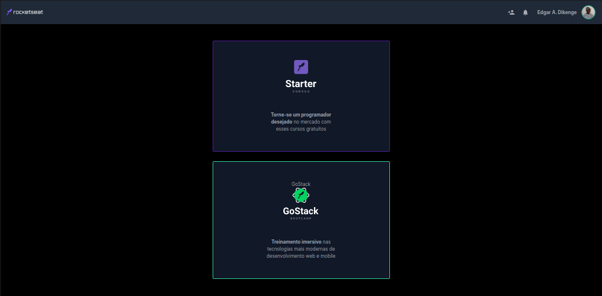

## Clone da pagina principal da @Rocketseat ##

## Descrição ##

Clone da pagina inicial da Rocketseat, plataforma de cursos encriveis.

Este clone foi criado no workshop do evento DoWhile 2020.

Tecólogias utilizadas:
 - Html5.
 - Tailwind css v2.
 
## Diferenças ##

A principal diferença está no avatar do clone nome e Algumas descrições basicas.

E esse tem Readme mais amigavel.

## Autor: Edgar A. Dikenge ##
